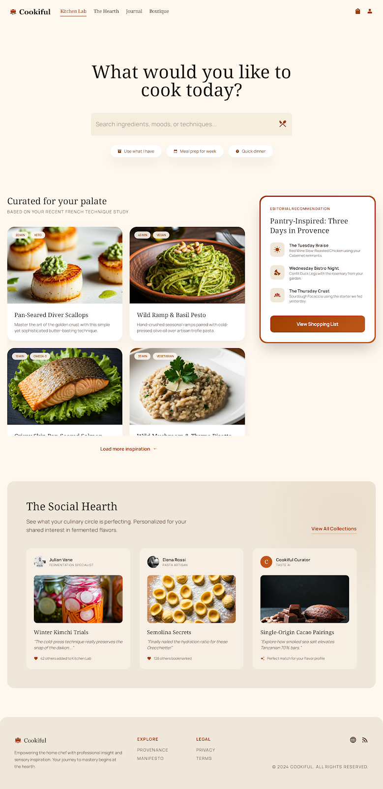
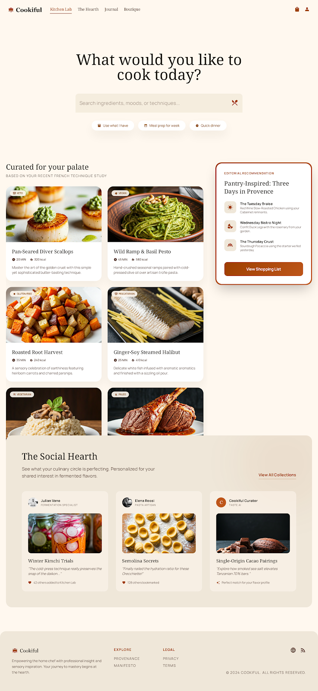
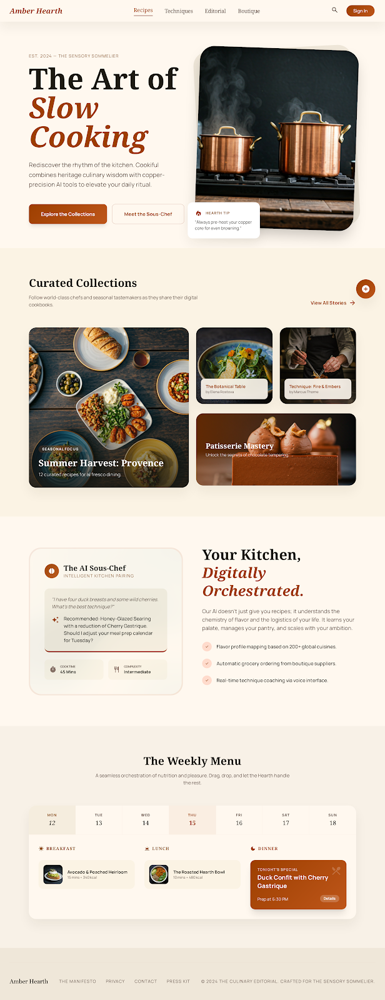
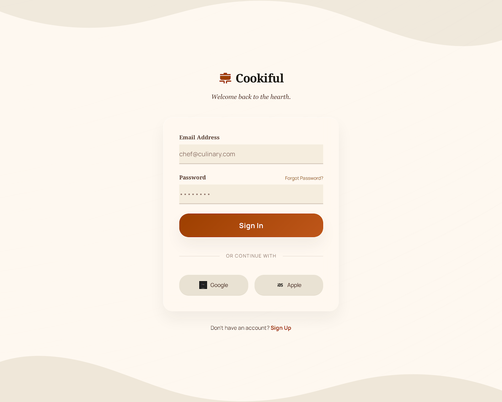

# Cookiful


Cookiful is a social cooking and recipe-planning app for discovering recipes, saving what looks good, turning saved recipes into a grocery workflow, and using pantry context to find the next thing to cook.

The current implementation is a working local monorepo with a Next.js web app, FastAPI API, PostgreSQL persistence, Redis, Docker development wiring, Recipe Box data importers, social recipe actions, pantry-backed grocery lists, and home-page recipe discovery.

## Product Preview

The app follows the Culinary Editorial design direction from `docs/design`: warm paper surfaces, copper accents, serif editorial type, and recipe-first layouts.

| Home | Expanded Feed |
| --- | --- |
|  |  |

| Landing | Login |
| --- | --- |
|  |  |

## What Works Today

- Home experience at `/home` with recipe title search, curated recipe feed, editorial recommendations, social highlights, and quick actions.
- Recipe discovery endpoints for curated recipes, title search, quick dinner ideas, and pantry matches.
- Auth flows for signup and login, with seed demo users for local development.
- Profile page with liked, saved, and reposted recipes.
- Groceries page at `/groceries` with saved-recipe ingredients grouped by recipe plus profile-backed pantry items.
- Social recipe actions for like, save, and repost.
- Docker development stack for Postgres, Redis, FastAPI, Next.js, and optional pgAdmin.
- Recipe import scripts for the bundled Recipe Box JSON datasets.

## Repository Map

```text
apps/
  api/        FastAPI app and route tests
  web/        Next.js App Router frontend
  mobile/     Mobile placeholder
  worker/     Background worker placeholder
packages/
  db/         SQLAlchemy models, migrations, seed/import scripts
  recipe-schema/
              Bundled Recipe Box JSON datasets and schema helpers
  types/ ui/ config/ ai-tools/ utils/
              Shared package placeholders and utilities
docs/
  architecture/
  api/
  product/
  design/     Design docs, screenshots, and logo assets
infrastructure/
  docker/     Local Docker Compose development stack
```

## Quick Start With Docker

From the repository root:

```bash
cd infrastructure/docker
docker compose -f docker-compose.dev.yml up --build
```

That starts:

- Web: `http://localhost:3000`
- API: `http://localhost:4000`
- Postgres: `localhost:5432`
- Redis: `localhost:6379`

Optional pgAdmin:

```bash
cd infrastructure/docker
docker compose -f docker-compose.dev.yml --profile tools up --build postgres redis pgadmin
```

pgAdmin runs at `http://localhost:5050`.

- Email: `admin@cookiful.dev`
- Password: `cookiful`

## Database Setup

With the Docker stack running, apply migrations and seed demo users:

```bash
docker exec cookiful-api python -m cookiful_db.scripts.apply_migration
docker exec cookiful-api python -m cookiful_db.scripts.seed
```

Import a sample of bundled recipe data:

```bash
docker exec cookiful-api python -m cookiful_db.scripts.import_recipe_box_json --limit 1000 --commit-every 100
```

Inspect the loaded recipes:

```bash
docker exec cookiful-api python -m cookiful_db.scripts.inspect_recipes --view --limit 10
```

The seed users all use the same local password: `cookiful-demo`.

| Email | Profile |
| --- | --- |
| `demo@cookiful.app` | Cookiful Demo |
| `mara@cookiful.app` | Mara Chen |
| `sol@cookiful.app` | Sol Rivera |
| `nora@cookiful.app` | Nora Bell |

## Deployment

Cookiful is scaffolded for a split deployment:

- GitHub Pages serves the static Next.js web export from `.github/workflows/deploy-web-pages.yml`.
- Render runs the FastAPI Docker service, managed Postgres, and Render Key Value from `render.yaml`.

See [Render and GitHub Pages Deployment](./docs/deployment/render-and-github-pages.md) for the required URLs, Render environment variables, and the remaining Next.js static-export blockers.

## Local Development Without Docker

Install workspace dependencies:

```bash
bun install
```

Start the web app:

```bash
bun --filter @cookiful/web dev
```

Start the API:

```bash
PYTHONPATH=packages/db/src:$(/usr/bin/python3 -m site --user-site):. \
  /usr/bin/python3 -m uvicorn apps.api.src.main:app --reload --host 0.0.0.0 --port 4000
```

Useful root scripts:

```bash
bun run db:migrate
bun run db:seed
bun run db:bootstrap:sample
bun run db:inspect:recipes
```

## Testing

Backend route tests:

```bash
python3 -m unittest apps.api.tests.test_recipes_route apps.api.tests.test_me_route
```

Focused web tests:

```bash
cd apps/web
./node_modules/.bin/vitest run src/features/home/recipes-client.test.ts src/features/groceries/groceries-data.test.ts src/features/profile/profile-data.test.ts
./node_modules/.bin/tsc --project tsconfig.json --noEmit
```

## Design Assets

Primary local assets used by the app and documentation:

- [Logo SVG](./docs/design/logos/logo.svg)
- [Icon SVG](./docs/design/logos/icon.svg)
- [Home screenshot](./docs/design/home/screen.png)
- [Expanded home screenshot](./docs/design/home/screen_expanded.png)
- [Landing screenshot](./docs/design/landing/landing.png)
- [Login screenshot](./docs/design/login/login.png)

The current visual direction is documented in:

- [Home design notes](./docs/design/home/DESIGN.md)
- [Landing design notes](./docs/design/landing/DESIGN.md)
- [Login design notes](./docs/design/login/DESIGN.md)

## Key Docs

- [Architecture Overview](./docs/architecture/overview.md)
- [Module Boundaries](./docs/architecture/modules.md)
- [ERD Summary](./docs/architecture/erd-summary.md)
- [MVP API Draft](./docs/api/mvp-endpoints.md)
- [Cooking Session State Machine](./docs/product/cooking-session-state-machine.md)
- [Meal Planning and Grocery Rules](./docs/product/meal-planning-grocery-rules.md)
- [Implementation Plan](./docs/implementation/mvp-plan.md)

## Notes

Some architecture documents describe the longer-term target shape. The codebase currently uses FastAPI for the API service, Next.js for the web app, SQLAlchemy/Postgres for persistence, and Docker Compose for local orchestration.
